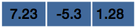
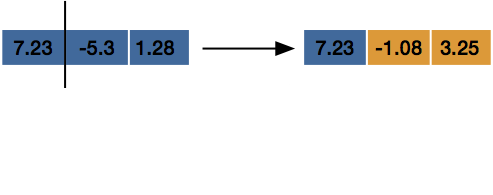

# Javascript Part 2! 

Up to now, you've been learning the basics of javascript! Now it's time for us to learn some of the more advanced functionality of javascript (and then apply it to our sites)!


### Arrays

Up to now, all of the variables that we've worked with have stored only one value. That's really helpful (and you'll use it a lot), but it's also possible to store a bunch of values in a single variable! These are what we call 'arrays'. 

Arrays are typically used to store a list of things that are similar, like names, dates, etc. 

Think of an array as a box with some values in it! 

```javascript
var array = [7.23, -5.3, 1.28]
```

Now we have an array called *array* (clever, right?) which we can think of like a box with those values inside: 




To access what's inside of an array, we need to use a special notation like: 

```javascript
arrayName[indexOfPosition]
```


All array elements have an index that starts counting at 0. `array` above has 3 indexes, numbered `0`, `1`, and `2`.  It may not make that much sense now, but that is the typical convention for how to write arrays in many langauges. 

To access elements in our var `array`, we then could use the notation: 

```javascript
console.log('The first element of our array is: ' + array[0])
console.log('The second element of our array is: ' + array[1])
console.log('The third element of our array is: ' + array[2])
```


And because our arrays are `var`s, we can change what's inside! [Let's start over with our code](https://codepen.io/bdpastl/pen/oOagmW?editors=0012): 

```javascript
var array = [7.23, -5.3, 1.28]

console.log('The first element of our array is: ' + array[0])
console.log('The second element of our array is: ' + array[1])
console.log('The third element of our array is: ' + array[2])

array[1] = -1.08
array[2] = 3.25

console.log('The first element of our array is: ' + array[0])
console.log('The second element of our array is: ' + array[1])
console.log('The third element of our array is: ' + array[2])
```


You can think of what's happening in `array` as: 



Now, what if, instead of having only 3 elements in our array, we had 100?  Instead of writing a console log for all 100 elements, we can use loops! Remember the `.length` we could use for strings? We can also use that for arrays! This is really good for knowing how many times we want to loop! [Check it out:](https://codepen.io/bdpastl/pen/KYGwJL?editors=0012) 

```javascript
var array = [7.23, -5.3, 1.28]

for(var i = 0; i < array.length; i++) {
  console.log('The element at index ' + i + ' is ' + array[i])
}

array[1] = -1.08
array[2] = 3.25

for(var i = 0; i < array.length; i++) {
  console.log('The element at index ' + i + ' is ' + array[i])
}
```


### EXERCISE: 

Create an array with numbers `[ 0, 1, 2, 3, 4, 5, 6, 7, 8, 9 ]`.  Write a for loop that iterates over an array and adds 1 to each of the elements. Print out the new array. 

Execute the loop 5 times. When you're done, your array should be holding: 

`[5, 6, 7, 8, 9, 10, 11, 12, 13, 14]`


### Objects: 

An object is another way to store data. Unlike arrays, however, objects aren't really lists. Objects are ways to store data of different kinds in one spot. Objects have what are called `key : value` pairs. You can access the value inside of the object by calling `object.key`. 

 Think of an object as a variable that has a bunch of other, named variables inside of it. An object looks like: 

```javascript
var myObject = {
  variableString: 'Something goes here', 
  variableString2: 'Something else goes here',
  variableNumber: 14,
  variableNumber2: 3.14
}
```


To access the values inside of `myObject`,  you need to use the `key`. You can do that by typing something like `myObject.variableString` and that would return the sentence `'Something goes here'`. Let's try printing the [elements of our object](https://codepen.io/bdpastl/pen/oORPZo?editors=0012): 

```Javascript
var myObject = {
  variableString: 'Something goes here', 
  variableString2: 'Something else goes here',
  variableNumber: 14,
  variableNumber2: 3.14
}


console.log('The insides of myObject are: ')
console.log(myObject.variableString)
console.log(myObject.variableString2)
console.log(myObject.variableNumber)
console.log(myObject.variableNumber2)
```


Any object is declared just like any other variable, but instead of directly assigning a value to it, you use curly braces `{ }` and then start declaring your keys value pairs! One thing to note is that your keys don't have to be named boring names like `variableNumber` or `variableString`. Keys can have any name. You can also : 

```Javascript
var myDetails = {
  name: 'My Name',
  birthday: 'MyBirthday', 
  favoriteFood: 'Pizza', 
  moneys: 1000000000,
  socialSecurityNumber: 123456789
}
```


Let's say for some reason, you decided that your favorite food wasn't pizza, and instead you wanted to change it to broccoli for some reason. You could change that by just [reassigning it like you do with a variable](https://codepen.io/bdpastl/pen/XQwPaN?editors=0012)! 

```javascript
var myDetails = {
  name: 'My Name',
  birthday: 'MyBirthday', 
  favoriteFood: 'Pizza', 
  moneys: 1000000000,
  socialSecurityNumber: 123456789
}

// for some reason you don't like pizza anymore: 
myDetails.favoriteFood = 'broccoli'

console.log('My new details are: ')
console.log(myDetails.name)
console.log(myDetails.birthday)
console.log(myDetails.favoriteFood)
console.log(myDetails.moneys)
console.log(myDetails.socialSecurityNumber)


```


### EXERCISE: 

Create an object called myObject. In this object, create 5 keys, name, age, school, favoriteFood, and favoriteTvShow. Once you create this, print all of your keys! 


### Mixing and Matching! 

The more you learn to code, the more you'll realize that you can mix and match everything we've done so far:

#### Objects with Arrays:

Just like our objects can store any data we want, we can also have them store arrays too! Suppose we took what we did above (reminder that we had changed our favorite food to broccoli):

```Javascript
var myDetails = {
  name: 'My Name',
  birthday: 'MyBirthday', 
  favoriteFood: 'broccoli', 
  moneys: 1000000000,
  socialSecurityNumber: 123456789
}
```


Instead of one favorite food, we wanted to have a whole list (why limit ourselves to just one!): 

```javascript
var myDetails = {
  name: 'My Name',
  birthday: 'MyBirthday', 
  favoriteFood: ['pizza', 'broccoli', 'ice cream', 'tacos', 'cabbage', 'brussels sprouts'], 
  moneys: 1000000000,
  socialSecurityNumber: 123456789
}
```


Now we can have a whole list of foods that we love! To access our foods, we just need to use the same notation we used with objects AND [mix that with the notation we used for arrays](https://codepen.io/bdpastl/pen/eoaLGz?editors=0012): 

```javascript
var myDetails = {
  name: 'My Name',
  birthday: 'MyBirthday', 
  favoriteFood: ['pizza', 'broccoli', 'ice cream', 'tacos', 'cabbage', 'brussels sprouts'], 
  moneys: 1000000000,
  socialSecurityNumber: 123456789
}

console.log('My first favorite food is: ', myDetails.favoriteFood[0])
console.log('My second most favorite food is: ', myDetails.favoriteFood[1])
console.log('My third most favorite food is: ', myDetails.favoriteFood[2])
console.log('My fourth most favorite food is: ', myDetails.favoriteFood[3])
console.log('My fifth most favorite food is: ', myDetails.favoriteFood[4])
console.log('My sixth most favorite food is: ', myDetails.favoriteFood[5])
```


That all looks fine and dandy, but wouldn't it be easier to use a loop? [Maybe a for loop](https://codepen.io/bdpastl/pen/KYLxyw?editors=0012)? 

```javascript
var myDetails = {
  name: 'My Name',
  birthday: 'MyBirthday', 
  favoriteFood: ['pizza', 'broccoli', 'ice cream', 'tacos', 'cabbage', 'brussels sprouts'], 
  moneys: 1000000000,
  socialSecurityNumber: 123456789
}

console.log('My favorite foods ranked in order are: ' )

for(var i = 0; i < 6; i++ ){
	console.log(i + '. ' + myDetails.favoriteFood[i]) //here we're using i to count from 0->5
}
```


Remember how arrays all have the `.length` property? We can use that in our for loop here: 

```javascript
var myDetails = {
  name: 'My Name',
  birthday: 'MyBirthday', 
  favoriteFood: ['pizza', 'broccoli', 'ice cream', 'tacos', 'cabbage', 'brussels sprouts'], 
  moneys: 1000000000,
  socialSecurityNumber: 123456789
}

console.log('My favorite foods ranked in order are: ' )

for(var i = 0; i < myDetails.favoriteFood.length; i++ ){    // use the .length! 
	console.log(i + '. ' + myDetails.favoriteFood[i]) 
}
```


### EXERCISE: 

Take the object from before and add a favorite food array!


#### Arrays of Objects: 

To create an array of objects, instead of using single 'primitive' types, we can use objects instead. Let's assume we're running a pizza restaurant and we need to send a list of pizza orders to our kitchen so they fire those pizzas up!

```javascript
var pizzaList =  [    		// open the array with the square brackets
  { 
    sizeInches: 12,      
    sauce: 'Tomato',
    style: 'Meat Lovers', 
  }, 
  { 
    sizeInches: 8,      
    sauce: 'Alfredo',
    style: 'Cheese', 
  },
  { 
    sizeInches: 12,      
    sauce: 'Tomato',
    style: 'Vegetarian', 
  }													// There's no comma at the end because it's the last element!
]

```


We'll need a way to print those pizzas out. We've seen objects with arrays in them, but how do we access they keys of objects inside of an array? The way we do that is like: 

```javascript
listName[indexPosition].key
```


It may look weird now, but you'll get used to it. Let's try by [printing our pizza list in a loop:](https://codepen.io/bdpastl/pen/rbgZEz?editors=0012) 

```javascript
var pizzaList =  [   
  { 
    sizeInches: 12,      
    sauce: 'Tomato',
    style: 'Meat Lovers', 
  }, 
  { 
    sizeInches: 8,      
    sauce: 'Alfredo',
    style: 'Cheese', 
  },
  { 
    sizeInches: 12,      
    sauce: 'Tomato',
    style: 'Veggie Lovers', 
  }
]

console.log('THE PIZZAS WE NEED TO MAKE ARE: ')
for (var i = 0; i < pizzaList.length; i++){
  console.log('Pizza ' + i)
  console.log('Size: ' + pizzaList[i].sizeInches) // listName[index].key
	console.log('Sauce: ' + pizzaList[i].sauce)
  console.log('Style: ' + pizzaList[i].style)
  console.log('\n')   // "\n" adds a new line in the console so we can separate the pizzas!
}
```


### EXERCISE: 

Create an array filled with objects. Each object needs to have `character`, `tvShow`.


### Arrays of Objects WITH Arrays in them: 


Here we're going to tackle two new ideas! First, what if we had a list of pizzas, but what if each of our pizzas had a list of ingredients? Let's see what that looks like first (we'll change our meat lovers to have a whole slew of meats, our vegetarian will have just veggies, and our cheese will have… well, cheese): 

```javascript
var pizzaList =  [   
  { 
    sizeInches: 12,      
    sauce: 'Tomato',
    ingredients: ['Pepperoni', 'Sausage', 'Bacon', 'Chicken', 'Anchovies', 'Bratwurst'], 
  }, 
  { 
    sizeInches: 8,      
    sauce: 'Alfredo',
    ingredients: ['Cheese'], 
  },
  { 
    sizeInches: 12,      
    sauce: 'Tomato',
    ingredients: ['Mushrooms', 'Spinach', 'Broccoli', 'Sweet Potato', 'Asparagus'], 
  }
]


```


Those pizzas look delicious, but how are we going to print them out? We know we can print an array pretty easily with a for loop. [We could try to hard code everything out like we've done before](https://codepen.io/bdpastl/pen/GLaXba?editors=0012): 

```javascript
var pizzaList =  [   
  { 
    sizeInches: 12,      
    sauce: 'Tomato',
    style: 'Meat Lovers',
    ingredients: ['Pepperoni', 'Sausage', 'Bacon', 'Chicken', 'Anchovies', 'Bratwurst'], 
  }, 
  { 
    sizeInches: 8,      
    sauce: 'Alfredo',
    style: 'Cheese',
    ingredients: ['Cheese'], 
  },
  { 
    sizeInches: 12,      
    sauce: 'Tomato',
    style: 'Veggie Lovers',
    ingredients: ['Mushrooms', 'Spinach', 'Broccoli', 'Sweet Potato', 'Asparagus'], 
  }
]

console.log('THE PIZZAS WE NEED TO MAKE ARE: ')
for (var i = 0; i < pizzaList.length; i++){
  console.log('Pizza ' + i)
  console.log('Size: ' + pizzaList[i].sizeInches) // listName[index].key
	console.log('Sauce: ' + pizzaList[i].sauce)
  console.log('Style: ' + pizzaList[i].style)
  console.log('Ingredients: ')
  console.log(pizzaList[i].ingredients[0])
  console.log(pizzaList[i].ingredients[1])
  console.log(pizzaList[i].ingredients[2])
  console.log(pizzaList[i].ingredients[3])
  console.log(pizzaList[i].ingredients[4])
  console.log(pizzaList[i].ingredients[5])  
  console.log('\n')   // "\n" adds a new line in the console so we can separate the pizzas!
}
```


What'd you notice? There were a lot of `undefined`s printed. That's because each of the objects has an ingredients list that is a different length! The `Meat Lovers` ingredients array is 6 elements long, the `Cheese` is just 1, and the `Veggie Lovers` is 5. 

Since arrays come with that fancy `.length` method, let's use it!  There's nothing that says we can't put a loop inside of a loop! [Let's give it a go!](https://codepen.io/bdpastl/pen/oORPKP?editors=0012) 

```javascript
var pizzaList =  [   
  { 
    sizeInches: 12,      
    sauce: 'Tomato',
    style: 'Meat Lovers',
    ingredients: ['Pepperoni', 'Sausage', 'Bacon', 'Chicken', 'Anchovies', 'Bratwurst'], 
  }, 
  { 
    sizeInches: 8,      
    sauce: 'Alfredo',
    style: 'Cheese',
    ingredients: ['Cheese'], 
  },
  { 
    sizeInches: 12,      
    sauce: 'Tomato',
    style: 'Veggie Lovers',
    ingredients: ['Mushrooms', 'Spinach', 'Broccoli', 'Sweet Potato', 'Asparagus'], 
  }
]

console.log('THE PIZZAS WE NEED TO MAKE ARE: ')
for (var i = 0; i < pizzaList.length; i++){
  console.log('Pizza ' + i)
  console.log('Size: ' + pizzaList[i].sizeInches) // listName[index].key
	console.log('Sauce: ' + pizzaList[i].sauce)
  console.log('Style: ' + pizzaList[i].style)
  console.log('Ingredients: ')
  
  // adding INSIDE loop here: Make sure to use a different variable for counting and not `i`
  for (var j = 0; j < pizzaList[i].ingredients.length; j++){
    console.log(pizzaList[i].ingredients[j])
  }
  
  console.log('\n')   // "\n" adds a new line in the console so we can separate the pizzas!
}
```


There's so much going on! Let's take a moment and look just at that internal `for` loop: 

```javascript
  // adding INSIDE loop here: Make sure to use a different variable for counting and not `i`
  for (var j = 0; j < pizzaList[i].ingredients.length; j++){
    console.log(pizzaList[i].ingredients[j])
  }
```


Here we are declaring a new loop, but this time we're usting `j` instead of `i`. That's because we've already declared an `i` above in the first for loop!  We need that `i` to access the `pizzaList` object by using `pizzaList[i]`. 

 When we're declaring our stopping codition in the `for` loop, see how we're accessing the length of ingredients by `pizzaList[i].ingredients.length`?  This works just like `pizzaList.length`, but now it's checking the length of the ingredients inside of of `pizzaList[i]`. 

Finally, to access each individual ingredient, notice how we're using `i` to denote which pizza we're looking at, and `j` to denote which ingredient we're looking at!

Loops inside of loops are called `nested loops`. They're very powerful, but they definitely take a minute to understand, so if it doesn't make too much sense right, no worries! We'll come back to these later. For now, take a look at this code [(which will print out every single `i` and `j` along with the pizzas and ingredients):](https://codepen.io/bdpastl/pen/rbgqBz?editors=0012) 

```javascript
var pizzaList =  [   
  { 
    sizeInches: 12,      
    sauce: 'Tomato',
    style: 'Meat Lovers',
    ingredients: ['Pepperoni', 'Sausage', 'Bacon', 'Chicken', 'Anchovies', 'Bratwurst'], 
  }, 
  { 
    sizeInches: 8,      
    sauce: 'Alfredo',
    style: 'Cheese',
    ingredients: ['Cheese'], 
  },
  { 
    sizeInches: 12,      
    sauce: 'Tomato',
    style: 'Veggie Lovers',
    ingredients: ['Mushrooms', 'Spinach', 'Broccoli', 'Sweet Potato', 'Asparagus'], 
  }
]

console.log('THE PIZZAS WE NEED TO MAKE ARE: ')
for (var i = 0; i < pizzaList.length; i++){
  console.log('Pizza ' + i)
  console.log('Size: ' + pizzaList[i].sizeInches) // listName[index].key
	console.log('Sauce: ' + pizzaList[i].sauce)
  console.log('Style: ' + pizzaList[i].style)
  console.log('Ingredients: ')
  
  // adding INSIDE loop here: Make sure to use a different variable for counting and not `i`
  for (var j = 0; j < pizzaList[i].ingredients.length; j++){
    console.log(pizzaList[i].ingredients[j] + ' : i = ' + i + ' j = ' + j )
  }
  
  console.log('\n')   // "\n" adds a new line in the console so we can separate the pizzas!
}
```


### EXERCISE: 

Take your charactrer and TV show array objects from before, and now make your character key an array to have as many characters from that tvShow as you can remember! 


### Functions: 

Functions are the most powerful part of any language! We've been using functions this entire time already, but we just didn't realize it. `console.log` is a function provided by javascript that lets us print to the console! 

What makes functions so powerful is that they  let us split our code up into small, reusable modules! They also let us keep our code really clean! Once our projects start getting really big, it's easy to lose place of where you put a certain chunk of code! 

There are many ways to write a function in javascript, but the way we're goin to write functions is like: 

```javascript
const functionName = function() {
  // function body
}
```


**Note**: you first probably noticed that we said `const`. That's because if you make your function a `var` you might accidentally write over it (because you can reassign variables to a new value)!

We called our function `functionName` and then assigned it the the value of `function(){  }`. What we just did was create an empty function. By using the `function()` keyword, we're saying that whenver we call this later (like when we call `console.log`) we'll get to execute whatever code we put in the body! [Let's give it a quick go](https://codepen.io/bdpastl/pen/vMwVBb?editors=0012): 

```javascript
const pizzaQuestion = function() {
  console.log('Do you like pizza?');
  console.log('OF COURSE YOU DO BECAUSE PIZZA IS AMAZING!')
};

pizzaQuestion()    // this calls the function
```


Now, when you have a function declared, notice that none of those console logs show up in our console. That's because the code can only be executed when we invoke our function! That's done by calling our function like `pizzaQuestion()`. 

**Note:** You absolutely need to write the `()` after your function name to call it. Otherwise, your console will just tell you that what you entered was a function. 


#### Parameters: 

One thing that makes functions really useful is that they can take in parameters! A parameter is a [special value that we "pass in" to our function](https://codepen.io/bdpastl/pen/dLEgyQ?editors=0012): 

```javascript
const functionName = function(parameter1, parameter2) {
	console.log('Parameter 1 is ', parameter1)
  console.log('Parameter 2 is ', parameter2)
}

// call it with the name: 
functionName('WHAT?', 'HUZZAH')
```

By passing variables into our functions, we can work with the data we pass and [do some pretty cool things](https://codepen.io/bdpastl/pen/NmVOPx?editors=0012)!

```javascript
const doMath = function(number1, number2) {
	var newNumber = number1 + number2
  console.log('The sum of ' + number1 + ' and ' + number2 + ' is ' + newNumber)
}

doMath(11, 22) // this calls the function by passing in numbers to doMath!
```


You don't have to pass in literal numbers and strings to functions! [You can also pass in variables!](https://codepen.io/bdpastl/pen/rbgqaG?editors=0012) 

```Javascript
const doMath = function(number1, number2) {
	var newNumber = number1 + number2
  console.log('The sum of ' + number1 + ' and ' + number2 + ' is ' + newNumber)
}

var eleven = 11
var twentyTwo = 22

doMath(eleven, twentyTwo) // this calls the function by passing in numbers to doMath!
```


#### Return Values: 

Functions would be great with just the ability to store code and take in parameters, but what makes functions so powerful is that they can also return values! Let's try one with no parameters, and go back to pizza. When you return a value from a function, [you need to have a variable catch it!](https://codepen.io/bdpastl/pen/gyJBbV?editors=0012):

```javascript 
const pizzaQuestion = function() {
  console.log('Do you like pizza?');
  console.log('OF COURSE YOU DO BECAUSE PIZZA IS AMAZING!')
  return "You're getting a cheese pizza!"
};

var pizzaReturn = pizzaQuestion()    // pizza question returned a string to the var
console.log(pizzaReturn) 						 // print what pizzaQuestion returned! 
```


When `pizzaQuestion` returned the string `"You're getting a cheese pizza"`, it stored that value in `pizzaReturn`. 


To make our functions more dynamic, we can actually pass data into them with the paramaters, and then return some data based off of what we passed in! [Let's go back to our `doMath` function:](https://codepen.io/bdpastl/pen/yrWRNM?editors=0012) 

```javascript
const doMath = function(number1, number2) {
	var newNumber = number1 + number2
  console.log('The sum of ' + number1 + ' and ' + number2 + ' is ' + newNumber)
  
  return newNumber
}

var eleven = 11
var twentyTwo = 22

var mathReturn = doMath(eleven, twentyTwo)  // return newNumber and stores it in mathReturn
```


In the above function, we not only passed data in, we also manipulated it to get a new value, and returned that data in a new variable!  Passing data back and forth is exactly how incredibly responsive websites are built! 


